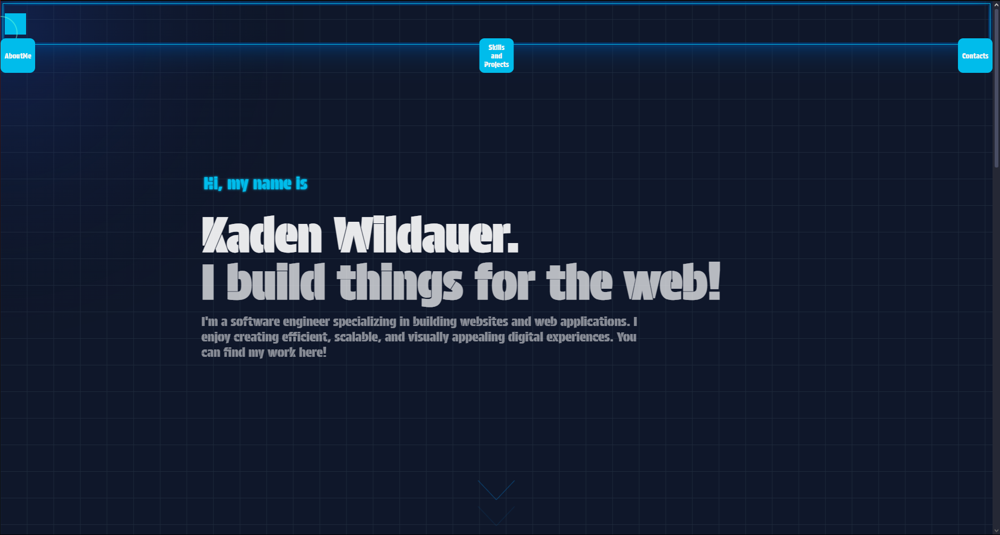
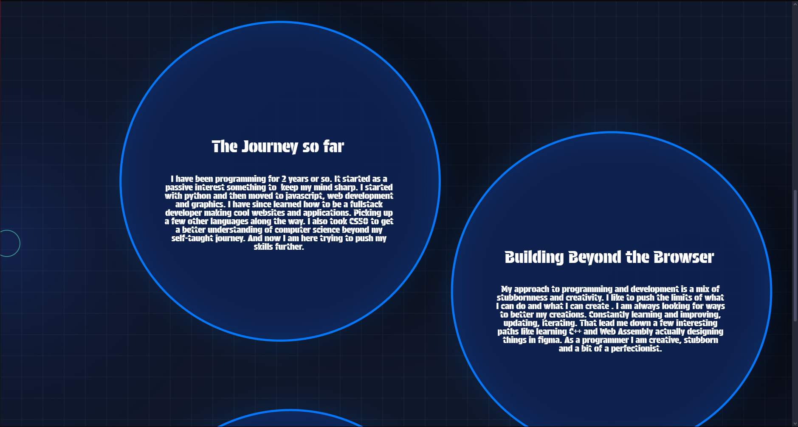
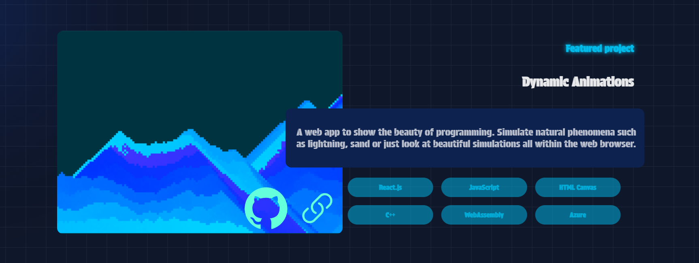
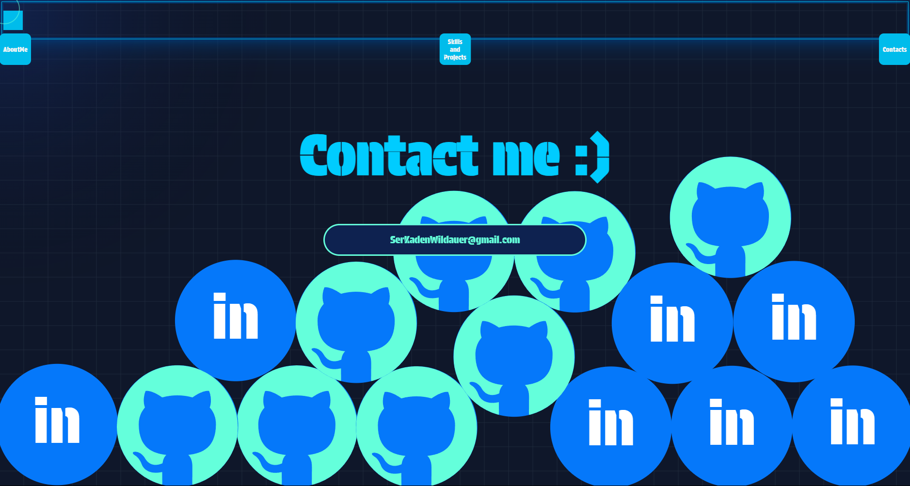

# Portfolio

A fun playground made to display all of my projects and the skills I’ve accumulated (: Hosted on Azure! Built to be fun to visit for anyone — not just a boring sell of myself, but a showcase of vision and evolution.

## Where its going

I still plan on adding lots of fun stuff. Currently, the main attention grabber is the About page. It has text blurbs that have friction, velocity, and gravity (if needed) and can be thrown around. A similar system was ported over to the Contact page,
which has about 20 or so balls with links to my GitHub and LinkedIn. I want to add square collisions for the folders on the Skills page, shadows on the About page for the blurbs, and text collisions. I was also thinking about using C++ and WASM if needed.

## Tech stack

- **Frontend**: JavaScript, React, Anime.js
- **Styling**: CSS 
- **Hosting**: Azure Static Web Apps
- **Build Tool**: Vite

## Features

- **Interactive Text Blurbs**: On the About page, text blurbs move with friction, velocity, and can be dragged to toss them around!
- **Falling Link Circles**: The Contact page features 20+ animated circles linking to my GitHub, LinkedIn, and more.
- **Highly Interactive UI**: Engaging animations and responsive design for a playful user experience.

## Link

www.kadenwildauer.com

## Screen shots

  
  
  

## Note

Come back here every once in a while. Maybe some things have changed or been added. If you blink, you might miss something cool :)

